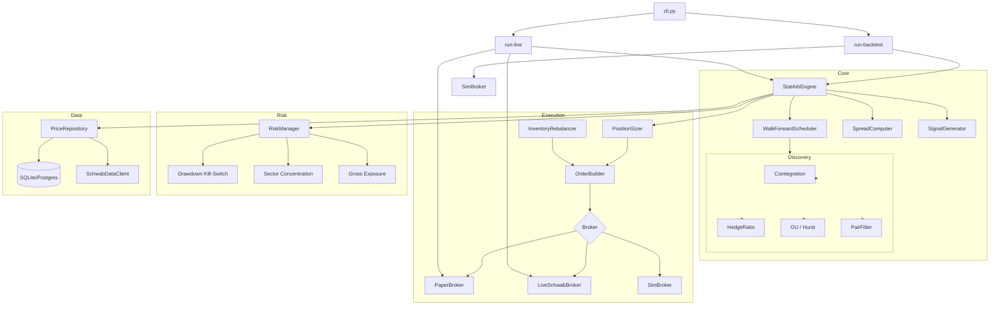

# Equity Stat-Arb

Pairs trading system that discovers cointegrated equity pairs via walk-forward Engle-Granger testing and trades mean reversion through the Charles Schwab API.

## Quick Start

```bash
# Install
pip install -e ".[dev]"

# Run a backtest
stat-arb run-backtest --start 2024-09-01 --end 2025-12-31

# Run a single live step (paper mode, default)
stat-arb run-live

# Run continuous paper trading
stat-arb run-live --loop
```

### Credentials

Set Schwab API credentials via environment variables or `config/local.yaml` (git-ignored):

```bash
export SCHWAB_APP_KEY="your_key"
export SCHWAB_APP_SECRET="your_secret"
```

See `SCHWAB_AUTH_SETUP.md` for initial OAuth2 token setup.

## Architecture



## Project Structure

```
src/stat_arb/
    cli.py              # Click CLI entry point
    live/runner.py      # Live/paper trading runner
    config/
        constants.py    # All enums (Signal, BrokerMode, etc.)
        settings.py     # Pydantic v2 config models + YAML loader
    data/
        schwab_client.py  # Schwab API wrapper (quotes, orders, history)
        price_repo.py     # DB-cached price repo with Schwab backfill
        db.py             # SQLAlchemy engine/session factory
        schemas.py        # ORM models
        universe.py       # Symbol universe and sector mapping
    discovery/
        pair_discovery.py   # Cointegration pipeline orchestrator
        cointegration.py    # Engle-Granger test
        hedge_ratio.py      # Kalman filter / OLS hedge ratio
        ou_params.py        # OU half-life + Hurst exponent
        pair_filter.py      # QualifiedPair dataclass + filter gates
    engine/
        stat_arb_engine.py  # Main orchestrator (step-per-day loop)
        walk_forward.py     # Window scheduler + formation runner
        signals.py          # Z-score state machine
        spread.py           # Z-score computation + slippage estimation
    execution/
        broker_base.py      # ExecutionBroker ABC, Order, Fill
        paper_broker.py     # Paper broker with adverse-fill slippage
        schwab_broker.py    # Live Schwab broker
        sizing.py           # Dollar-based position sizer
        order_builder.py    # Signal → Order translation
        rebalancer.py       # Marginal delta rebalancing at window transitions
    risk/
        risk_manager.py      # Portfolio risk gate (drawdown, exposure, sector)
        structural_break.py  # ADF-based structural break monitor
        model_decay.py       # Kalman fallback + half-life trend tracker
    backtest/
        walk_forward_bt.py  # Walk-forward backtest orchestrator
        sim_broker.py       # Backtest simulation broker
        results.py          # BacktestResult + TradeRecord
    reporting/
        metrics.py          # Sharpe, max drawdown, win rate, profit factor
        alerts.py           # Monitoring alert manager
```

## Configuration

All settings live in `config/default.yaml` with Pydantic v2 validation. Key sections:

| Section | Purpose | Key Params |
|---------|---------|------------|
| `schwab` | API credentials | `app_key`, `app_secret` |
| `universe` | Tradable symbols by sector | `sectors`, `min_price`, `min_avg_volume` |
| `discovery` | Pair discovery gates | `coint_pvalue=0.05`, `max_hurst=0.5`, `max_half_life_days=30` |
| `signal` | Z-score thresholds | `entry_z=2.0`, `exit_z=0.5`, `stop_z=4.0` |
| `sizing` | Position sizing | `dollars_per_leg=1500`, `max_gross_per_pair=3000` |
| `risk` | Portfolio limits | `max_pairs=10`, `max_gross_exposure=25000`, `max_drawdown_pct=0.10` |
| `walk_forward` | Window durations | `formation_days=252`, `trading_days=63` |
| `broker_mode` | Execution backend | `paper` (default), `live`, `sim` |

## Docker Deployment

Target: `mrm-x86` (Ubuntu VM, Tailscale `100.87.161.31`)

```bash
# Copy env file and fill in credentials
cp docker/.env.example docker/.env

# Build and run paper trading (single step)
docker compose -f docker/docker-compose.yaml up live-paper

# Run continuous loop
docker compose -f docker/docker-compose.yaml --profile loop up -d live-loop

# Run a backtest
BT_START=2024-09-01 BT_END=2025-12-31 \
  docker compose -f docker/docker-compose.yaml --profile backtest run backtest

# View logs
docker compose -f docker/docker-compose.yaml logs -f
```

### Remote deployment

```bash
SSH="ssh -i ~/.ssh/proxmox_codex_ed25519 james@100.87.161.31"

# Start Docker
$SSH "sudo systemctl start docker"

# Clone and deploy
$SSH "git clone <repo-url> ~/equity_stat_arb && cd ~/equity_stat_arb && \
  cp docker/.env.example docker/.env && \
  # Edit docker/.env with real credentials \
  docker compose -f docker/docker-compose.yaml --profile loop up -d live-loop"
```

## Testing

```bash
pytest tests/unit/ -v         # Unit tests (pure logic, no I/O)
pytest tests/integration/ -v  # DB + mocked API tests
pytest tests/backtest/ -v     # Walk-forward backtest integration
pytest tests/ -v              # All tests
ruff check src/ tests/        # Lint
```

## Safety

- **Default mode is paper trading.** Real trading requires explicit `--broker-mode=live` on the command line.
- Drawdown kill-switch permanently halts trading at the configured threshold (default 10%).
- Sector concentration and gross exposure limits prevent over-concentration.
- All credentials use `SecretStr` — never logged or printed.
